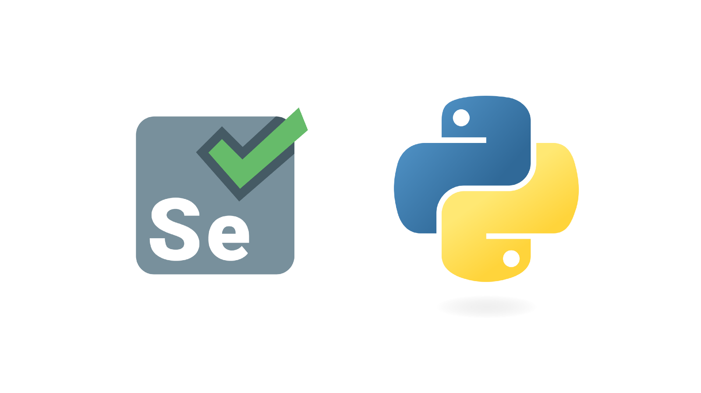

# Automating-Codechef-Solutions
Automating solutions using Selenium .

*Selenium is an open-source web-based automation tool. Python language is used with Selenium for testing. It has far less verbose and easy to use than any other programming language. ... Selenium can send the standard Python commands to different browsers, despite variation in their browser's design.*

### Here is the link to download the Drivers -> 
https://sites.google.com/a/chromium.org/chromedriver/downloads

## Steps ->
- pip3 install selenium
- install the drivers of your web browser
- import webdriver using selenium
